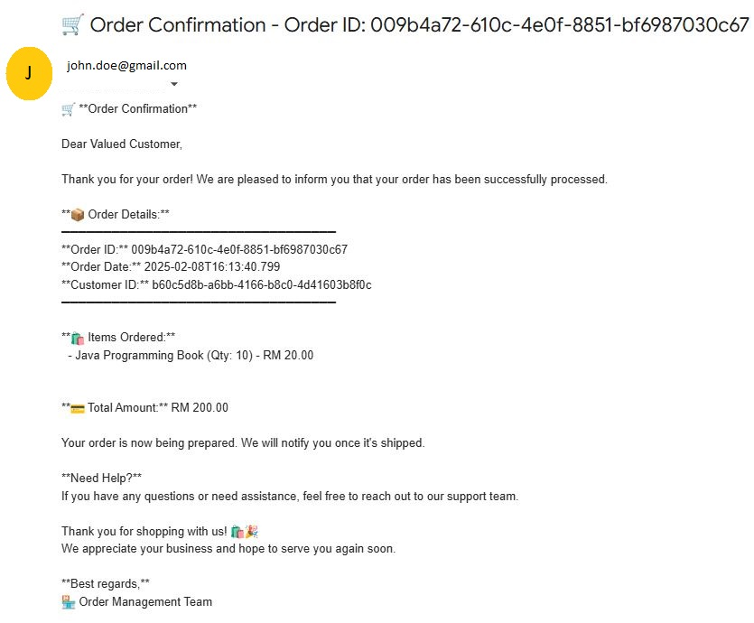
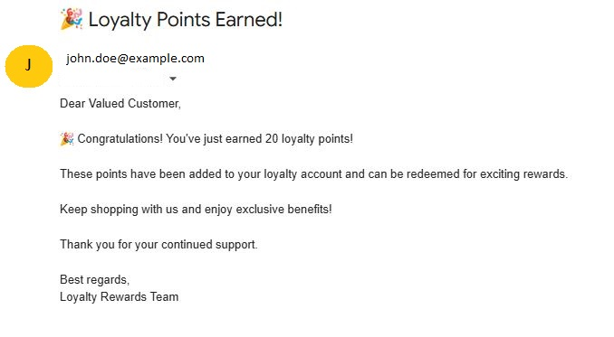

# 🚀 Template-BE (Backend Template) E-Commerce System

A **Spring Boot-based microservices application** that enables customers to **place orders, receive email notifications, and earn loyalty points**. It follows an **event-driven architecture** using **Kafka** and **WebFlux** for communication.

## 🏗️ Architecture Overview
This project consists of **three microservices**:

1️⃣ **Order Management Service**
- Handles order creation and retrieval.
- Publishes an event to **Kafka** after an order is placed.

2️⃣ **Notification Service**
- Listens for order events from Kafka.
- Sends order confirmation emails to customers.

3️⃣ **Loyalty Service**
- Listens for order events from Kafka.
- Processes loyalty points based on total order amount.
- Calls **Notification Service** (via **WebFlux**) to notify customers if points are awarded.

---

## ⚙️ Tech Stack
| Technology                  | Purpose                                |
|-----------------------------|----------------------------------------|
| **Java 17+**                | Programming Language                   |
| **Spring Boot 3.4.x**       | Application Framework                  |
| **Spring WebFlux**          | Reactive Programming (Loyalty Service) |
| **Spring Data JPA**         | Database Interaction                   |
| **Kafka**                   | Event Streaming                        |
| **OpenAPI (SpringDoc)**     | API Documentation                      |
| **PostgreSQL**              | Relational Database                    |
| **Groovy & Spock**          | Unit Testing                           |
| **Maven**                   | Dependency Management                  |
| **Docker & Docker Compose** | Containerization                       |
| **GitHub Actions**          | [CI/CD Pipeline](https://github.com/DzakirinMD/template-be/actions)                     |

---

## 📡 Microservices and Data Flow
### 🔹 1️⃣ Order Management Service
✅ **Handles orders**  
✅ **Publishes events to Kafka**  
✅ **Stores orders in PostgreSQL**

📌 **Flow:**
- Customer places an [order](http://localhost:10003/swagger-ui/index.html#/order-controller/createOrder).
- Order details are **saved** in the database.
- A **Kafka event** (`order-data-changed` topic) is **published**.
- **Notification Service** and **Loyalty Service** consume this event.

### 🔹 2️⃣ Notification Service
✅ **Consumes Kafka events**  
✅ **Sends confirmation emails to customers**

📌 **Flow:**
- Listens for `order-data-changed` event.
- Sends an **email confirmation** to the customer.

### 🔹 3️⃣ Loyalty Service
✅ **Processes loyalty points**  
✅ **Calls Notification Service (via WebFlux) if points are awarded**

📌 **Flow:**
- Listens for `order-data-changed` event.
- Checks **loyalty rules**:
   - If the **order amount meets the threshold**, points are awarded.
   - Calls **Notification Service** via **WebFlux** to notify the customer.
   - If no points are awarded, logs the event.

---

## 🗄️ Database Schema
### 🔹 Identity Service
| Table Name         | Description                 |
|--------------------|-----------------------------|
| `roles`            | Stores roles.         |
| `user_credentials` | Stores customer credentials. |
| `user_roles`           | Stores customers role.      |

### 🔹 User Service
| Table Name | Description               |
|------------|---------------------------|
| `user_profiles` | Stores customer profiles. |

### 🔹 Order Management Service
| Table Name | Description |
|------------|------------|
| `products` | Stores product information. |
| `orders` | Stores orders linked to customers. |
| `order_items` | Many-to-many mapping between orders and products. |

### 🔹 Loyalty Service
| Table Name | Description |
|------------|------------|
| `loyalty_points` | Stores customer points balance. |
| `loyalty_transactions` | Tracks loyalty transactions (earned/redeemed points). |
| `loyalty_rules` | Defines rules for awarding points. |

---

## 📢 Kafka Topics
| Topic Name | Description | Producer                 | Consumer                       |
|------------|-------------|--------------------------|--------------------------------|
| `order-data-changed` | Published when an order is created. | order-management-service | notification-service, loyalty-service |

---

## 🚀 Running the Application

📌 **For Production Mode**, see 👉 [Setup and Running the Services in Prod Mode](#setup-and-running-the-services-in-prod-mode)    
📌 **For Development Mode**, see 👉 [Setup and Running the Services in Dev Mode](#setup-and-running-the-services-in-dev-mode)

---

## 🏭 Setup and Running the Services in Prod Mode
### 1️⃣ Clone the Repository
```sh
git clone https://github.com/DzakirinMD/template-be.git
cd template-be
```

### 2️⃣ Start the Services
Run all services using **Docker Compose**:
```sh
mvn clean package
docker-compose up --build -d
```
⚠️ **Wait ~30 seconds** for services to start. Startup performance depends on your computer.

### 3️⃣ Connect to the Database
You can connect to the **PostgreSQL database** using the following credentials:

```
🔗 **Connection URL:** `jdbc:postgresql://localhost:5435/postgres`
👤 **User:** `postgres`
🔑 **Password:** `postgres`
📂 **Database:** `postgres`
```

#### **Connect Using CLI**
```sh
psql -h localhost -p 5435 -U postgres -d postgres
```

#### **Connect Using DBeaver / PgAdmin**
- **Host:** `localhost`
- **Port:** `5435`
- **Username:** `postgres`
- **Password:** `postgres`
- **Database Name:** `postgres`

### 4️⃣ Stop the Services
```sh
docker-compose down
```

### 5️⃣ Reset the Environment
```sh
docker-compose down -v  # Removes volumes
rm -rf docker-data      # Deletes all stored data
```

---

## 🛠 Setup and Running the Services in Dev Mode
### 1️⃣ Clone the Repository
```sh
git clone https://github.com/DzakirinMD/template-be.git
cd template-be
```

### 2️⃣ Start the **Kafka & Database Only**
```sh
mvn clean package
docker-compose -f docker-compose-dev.yml up --build -d
```
⚠️ **After this, start each microservice manually!**  
⚠️ **Set environment variable** → `spring.profiles.active=dev` when running services.

### 3️⃣ Connect to the Database
You can connect to the **PostgreSQL database** using the following credentials:

```
🔗 **Connection URL:** `jdbc:postgresql://localhost:5435/postgres`
👤 **User:** `postgres`
🔑 **Password:** `postgres`
📂 **Database:** `postgres`
```

#### **Connect Using CLI**
```sh
psql -h localhost -p 5435 -U postgres -d postgres
```

#### **Connect Using DBeaver / PgAdmin**
- **Host:** `localhost`
- **Port:** `5435`
- **Username:** `postgres`
- **Password:** `postgres`
- **Database Name:** `postgres`

### 4️⃣ Stop the Services
```sh
docker-compose -f docker-compose-dev.yml down
```

### 5️⃣ Reset the Environment
```sh
docker-compose down -v  # Removes volumes
rm -rf docker-data      # Deletes all stored data
```

---

## 📜 Microservices API Documentation
| Service            | Swagger URL                                                                      |
|--------------------|----------------------------------------------------------------------------------|
| 🔐 Identity Service | [http://localhost:10001/swagger-ui.html](http://localhost:10001/swagger-ui.html) |
| 👤 User Service | [http://localhost:10002/swagger-ui.html](http://localhost:10002/swagger-ui.html) |
| 📦 Order Management | [http://localhost:10003/swagger-ui.html](http://localhost:10003/swagger-ui.html) |
| ✉️ Notification Service   | [http://localhost:10004/swagger-ui.html](http://localhost:10004/swagger-ui.html) |
| 🏆 Loyalty Service  | [http://localhost:10005/swagger-ui.html](http://localhost:10005/swagger-ui.html) |
| 🔄 Kafka-UI        | [http://localhost:18080](http://localhost:18080)                                 |

---

## 📧 Expected Email Notifications
⚠️❗ IMPORTANT NOTICE ❗⚠️

If you did not receive an email after placing an order, please check your `notification-service` configuration:

🔹 Open the `application.properties` file in the Notification Service. <br/>
🔹 Ensure `spring.mail.username` and `spring.mail.password` are correctly set. <br/>
🔹 Recommended: Use Gmail as it has been tested and confirmed to work. <br/>

💡 Tip: If using Gmail, enable "Less Secure Apps" or set up an [App Password](https://support.google.com/mail/answer/185833?hl=en) for better security. 🚀 <br/>

When an order is placed, an order confirmation email is sent:



<br/>

If loyalty points are awarded, another loyalty reward email is sent:



---

## 📌 Summary
- 🏗️ **Microservices Architecture** using **Kafka** and **WebFlux**.
- ⚙️ **PostgreSQL**, **Spring Boot**, and **Maven**.
- ✅ **Fully containerized** with **Docker Compose**.
- 🔄 [**CI/CD** using **GitHub Actions**.  ](https://github.com/DzakirinMD/template-be/actions)
- 📜 **OpenAPI documentation** for API testing.

🚀 **Follow the setup instructions above to start the application!** 🚀
